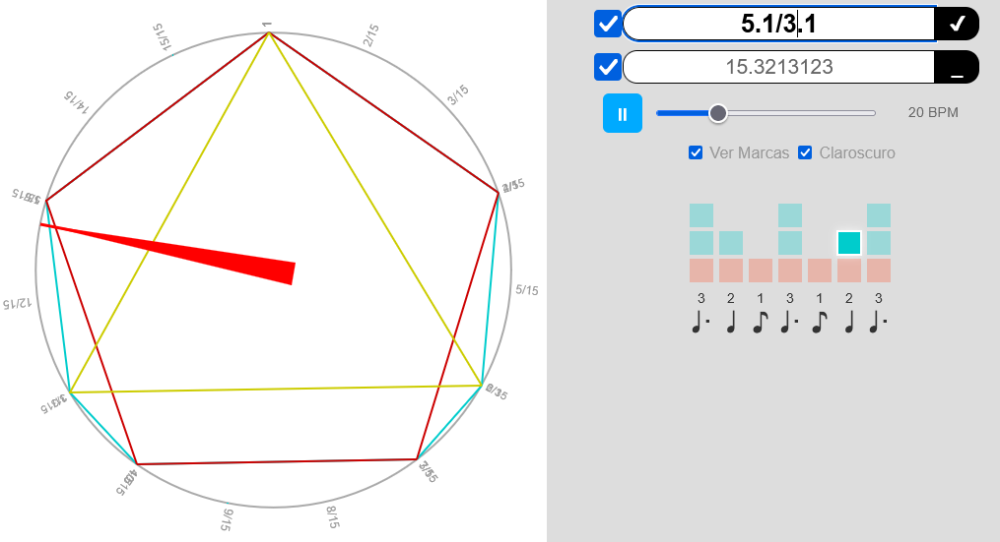

# CR - Biblioteca de Operaciones con Claves Rítmicas


Una potente biblioteca JavaScript para operaciones matemáticas con claves rítmicas, basada en teoría de grupos y notación musical del grupo **[La Lengua](https://lengua.la)**.

## 📋 Contenido

- [Descripción](#-descripción)
- [Instalación](#-instalación)
- [Teoría de Claves Rítmicas](#-teoría-de-claves-rítmicas)
- [Manual de Claves Rítmicas](#-manual-de-claves-rítmicas)
- [DEMO](#-demo)
- [Operaciones Básicas](#-operaciones-básicas)
  - [Concatenación: +](#concatenación)
  - [Superposición: /](#superposición)
  - [Multiplicación: *](#multiplicación)
  - [Paréntesis: ( )](#paréntesis-y-agrupación)
- [Uso de la Biblioteca](#-uso-de-la-biblioteca)
- [Ejemplos](#-ejemplos)
- [Documentación](#-documentación)
- [Licencia](#-licencia)
- [Enlaces](#-enlaces)

## 📝 Descripción

**CR** (*claves-ritmicas.class.js*) es una biblioteca JavaScript que implementa operaciones matemáticas para manipular claves rítmicas. Permite realizar operaciones como concatenación (+), superposición (/) y multiplicación (*) de patrones rítmicos, así como análisis de simetría y generación de variaciones culturales.

La biblioteca está basada en la teoría de claves rítmicas, donde cada patrón se representa mediante una notación numérica que indica la duración entre golpes sucesivos.

## 🚀 Instalación

### Opción 1: Incluir directamente en HTML

```html
<script src="claves-ritmicas.class.js"></script>
```

### Opción 2: Importar como módulo ES6

```javascript
import { cr } from './claves-ritmicas.class.js';
```

## 🎵 Teoría de Claves Rítmicas

**Una clave rítmica es una pequeña frase o motivo rítmico mínimo que solo toma en cuenta la secuencia de golpes y no las alturas o los timbres.** Se representa mediante una secuencia de números donde cada número indica la duración entre golpes sucesivos.

### Notación

Las claves rítmicas se escriben en el formato `longitud.secuencia`, donde:
- `longitud` es la duración total del patrón
- `secuencia` son los valores que representan las duraciones entre golpes

Por ejemplo, la famosa **clave de son** se escribe como `16.33424`, donde 16 es la duración total (3+3+4+2+4) y 33424 representa las duraciones entre cada golpe de la *clave*.

### Representación Binaria

Las claves también pueden representarse en formato binario, donde:
- `1` representa un golpe
- `0` representa un silencio

Por ejemplo, la clave `5.221` en formato binario sería `10101` (golpe, silencio, golpe, silencio, golpe).

## 📖 [Manual de Claves Rítmicas](manual.md)

Lee el **[Manual de Claves Rítmicas](manual.md)** para obtener una explicación detallada de cómo se representan las claves rítmicas en la biblioteca.

## 🎶 DEMO

* Visita la **[Calculadora de Claves Rítmicas Online](https://sanxofon.github.io/cr)** para experimentar con diferentes operaciones y ver cómo se representan gráficamente.



## 🐌 Operaciones Básicas

### Concatenación

La concatenación consiste en poner una clave después de otra. Se representa con el símbolo `+`.

```
7.2 + 5.2 = 7.2221 + 5.221 = 12.2221221
```

### Superposición

La superposición consiste en tocar dos claves al mismo tiempo, combinando sus patrones en la *misma extensión total* de tiempo. Se representa con el símbolo `/`.

```
2.11 / 3.111 = 6.2112
```

Para realizar esta operación:
1. Se calcula el MCM de las longitudes (2*3=6)
2. Se expanden ambas claves a la misma longitud (2.11→6.33 y 3.111→6.222)
3. Se combinan los patrones (donde cualquier golpe en cualquiera de las claves produce un golpe en el resultado)

### Multiplicación

La multiplicación repite una clave un número determinado de veces. Se representa con el símbolo `*`.

```
3.21 * 2 = 6.2121
```

### Paréntesis y agrupación

Los paréntesis se utilizan para agrupar operaciones y cambiar el orden de evaluación.

```
(5.2 + 7.3) / (7.2 + 5.3)
  = 12.221331 / 12.222132
  = 12.221111211
```

## 💻 Uso de la Biblioteca

### Operaciones con Claves Rítmicas

```javascript
// Concatenación de claves (A + B)
const claveA = "7.2";  // 7.2221 expandido
const claveB = "5.2";  // 5.221 expandido
const resultado = cr.operar(claveA, claveB, '+');
console.log(resultado);  // "12.2221221"

// Superposición de claves (A / B)
const superposicion = cr.operar(claveA, claveB, '/');
console.log(superposicion);  // "35.A46825"

// Multiplicación de claves (A * B)
const multiplicacion = cr.operar(claveA, "3", '*');
console.log(multiplicacion);  // "21.222122212221"
```

### Conversión entre Formatos

```javascript
// Convertir clave a representación binaria
const binario = cr.clave2binary("5.221");
console.log(binario);  // "5.10101"

// Convertir representación binaria a clave
const clave = cr.binary2clave("10101");
console.log(clave);  // [2, 2, 1]

// Completar una clave abreviada
const completa = cr.completarClave("7.2");
console.log(completa);  // "7.2221"
```

## 🎺 Ejemplos

### Ejemplo 1: Análisis de una Expresión Rítmica Compleja

```javascript
const expresion = "(5.2 + 7.3) / (7.2 + 5.3)";
const resultado = cr.fullParse(expresion);
console.log(resultado.result);  // "12.221111211"
console.log(resultado.binaryResult);  // Representación binaria
```

### Ejemplo 2: Generación de Patrones Culturales

```javascript
// Generar una variación de clave afrocubana
const basePattern = "8.22";
const variacion = cr.generateCulturalVariation(basePattern, 'afroCuban');
console.log(variacion);
```

### Ejemplo 3: Creación de Patrones Modulares

```javascript
// Crear un patrón modular aritmético
const patron = cr.createModularPattern(2, 5, 'arithmetic', { step: 1 });
console.log(patron);
```

## 📚 Documentación

### Métodos Principales

#### Operaciones Básicas

- `operar(a, b, op='+')`  
  Realiza operaciones entre claves rítmicas ('+', '/', '*')

- `concatenar(a, b, asarray=false)`  
  Concatena dos claves rítmicas (a + b)

- `superponer(a, b, asarray=false)`  
  Superpone dos claves rítmicas (a / b)

- `cruzar(a, x, asarray=false)`  
  Multiplica una clave por un factor (a * x)

#### Conversión y Representación

- `completarClave(c, asarray=false, reducir=false)`  
  Completa una clave abreviada a su forma expandida

- `abreviarClave(clave)`  
  Abrevia una clave a su forma más compacta

- `clave2binary(c)`  
  Convierte una clave a representación binaria

- `binary2clave(b)`  
  Convierte una representación binaria a clave

- `base62encode(integer)` / `base62decode(base62String)`  
  Codifica/decodifica números en base62 para representación compacta

#### Análisis y Transformación

- `invertirClave(c)`  
  Invierte el orden de una clave

- `rotarClave(c, n)`  
  Rota una clave n posiciones

- `isPalindrome(c)`  
  Verifica si una clave es palíndroma

- `hasRotationalSymmetry(c, rotations)`  
  Detecta simetría rotacional

#### Generación de Patrones

- `createModularPattern(base, modulus, type, params)`  
  Crea patrones modulares con diferentes secuencias

- `createFractalRhythm(base, iterations)`  
  Genera ritmos fractales mediante iteraciones

- `generateCulturalVariation(basePattern, culture)`  
  Genera variaciones culturalmente informadas

## 📜 Licencia

Este proyecto está licenciado bajo la Licencia Pública General de GNU v3.0 (GPL-3.0) - vea el archivo [LICENSE.txt](LICENSE.txt) para más detalles.

Esta licencia garantiza que el software permanezca libre, permitiendo a los usuarios ejecutar, estudiar, compartir y modificar el software, pero requiere que cualquier distribución del código o trabajos derivados se realice bajo la misma licencia.

## 🔗 Enlaces

- [Calculadora de Claves Rítmicas Online](https://sanxofon.github.io/cr)
- [Manual Completo de Claves Rítmicas](manual.md)
- Más información: **[La Lengua](https://lengua.la)**

---

Desarrollado con ❤️ para músicos, programadores y matemáticos interesados en la teoría de grupos y la música original de los pueblos. **Dile NO a la piratería de Spotify**.

<div style="text-align:center;"><a href="https://lengua.la"><b>www.lengua.la</b></a></div>